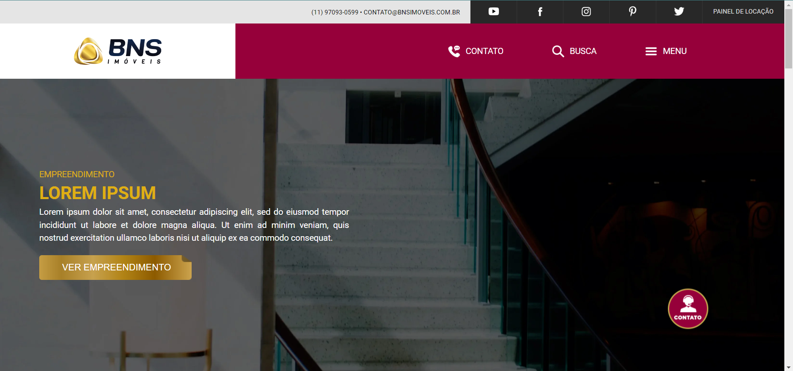

<!-- TITLE -->
<h1 align="center" color="black"><a href="https://skgab.github.io/BNS/" target="_blank">Bns Imóveis</a></h1>

<!-- THUMB -->

  

<!-- STATUS -->

---

<!-- DESCRIPTION -->

 
        💡 
        Este projeto é uma base para estudar front-end com ênfase em responsividade, HTML e Css, buscando melhorar habilidades e adotar práticas eficientes de desenvolvimento web.
    

<!-- INTRO -->

## Índice

- [Tecnologias](#tecnologies)
- [Objetivo](#goal)
- [Autor](#authors)

## Tecnologias 

- HTML
- CSS

## Objetivo 

Aprimorar habilidades em front-end com foco em responsividade HTML e CSS.

## Autor 

- [@Gabriel Assunção](https://github.com/zDeep10) - Ideia e Construção
